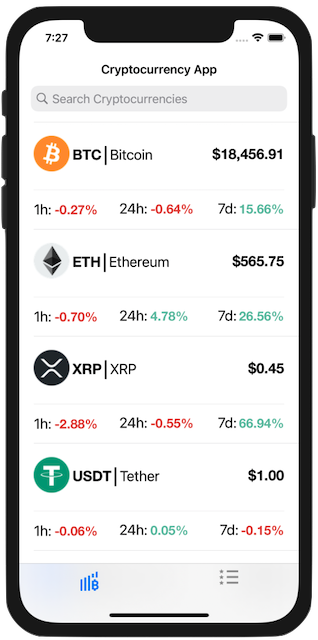
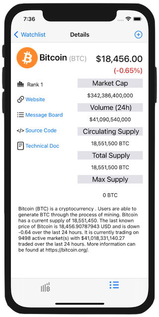
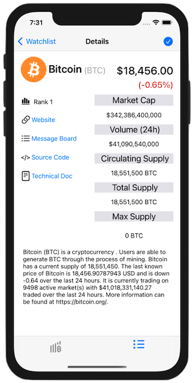
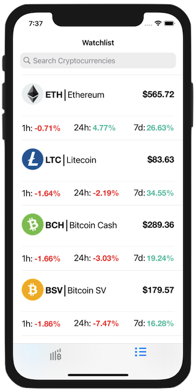
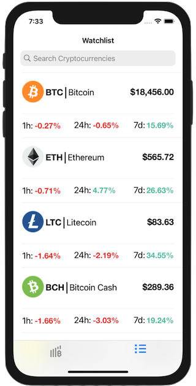

# Crypto-Tracker
Udacity iOS Development Capstone Project
## Description
The Cryptocurrency Tracker App allows you to track your favorite cryptocurrencies.
### Cryptocurrency App Homepage View

When you open the Cryptocurrency Tracker app, you're presented with the Top 1,500 cryptocurrenies.
### Crypotcurrency Watchlist View

When you add cryptocurrenies to your watchlist you can find them here.
### Cryptocurrency Detail View

When you select a table cell, you're segued to the Detail View. You can add the cryptocurrency to the Watchlist by pressing the plus-sign in top right hand corner.
## Limitations
This app uses the sandbox CoinMarketCap API Endpoint and Key. This app makes a lot of API request to get the data needed to make this app functional. You can sign up and replace the test API Key with your own, if you want to see real time data.
## CoinMarketCap API
The CoinMarketCap API was used to make this app, https://coinmarketcap.com/api/